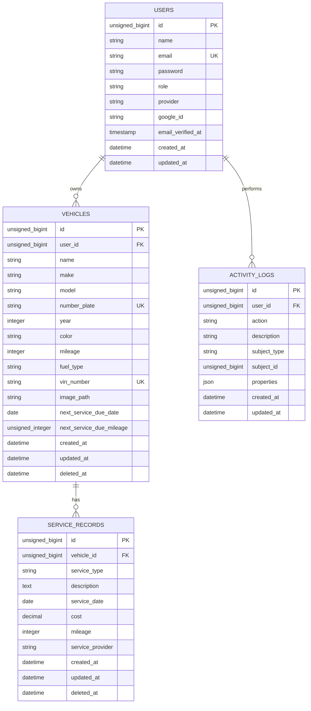

# Database Design Documentation - VehiclePro

This document contains the complete database design for the VehiclePro Laravel application, formatted for the SSP2 report.

## 1. Entity Relationship (ER) Diagram

### 1.1 Mermaid Format

### 1.2 Text Version (Crow's Foot Notation)
- **USERS** (1) ---- (N) **VEHICLES**
  - A user can own multiple vehicles.
  - A vehicle must belong to exactly one user.
- **VEHICLES** (1) ---- (N) **SERVICE_RECORDS**
  - A vehicle can have multiple service history records.
  - A service record must belong to exactly one vehicle.

---

## 2. Database Schema Documentation

### 2.1 Table: users
Stores user account and authentication details.

| Column | Data Type | Constraints | Description |
| :--- | :--- | :--- | :--- |
| `id` | BigInt (Unsigned) | Primary Key, Auto Increment | Unique identifier for each user. |
| `name` | String | Not Null | User's full name. |
| `email` | String | Unique, Not Null | Email used for login and notifications. |
| `password` | String | Not Null | Hashed password for security. |
| `role` | String (20) | Default: 'user' | Access level (e.g., admin, user). |
| `google_id` | String | Unique, Nullable | Identifier for Google OAuth. |
| `email_verified_at` | Timestamp | Nullable | Date/Time the user verified their email. |
| `created_at` | Timestamp | Not Null | Record creation timestamp. |
| `updated_at` | Timestamp | Not Null | Record last update timestamp. |

### 2.2 Table: vehicles
Stores information about the vehicles registered in the system.

| Column | Data Type | Constraints | Description |
| :--- | :--- | :--- | :--- |
| `id` | BigInt (Unsigned) | Primary Key, Auto Increment | Unique identifier for the vehicle. |
| `user_id` | Foreign Key | FK -> users(id), Cascade On Delete | Links the vehicle to its owner. |
| `name` | String | Not Null | Friendly name (e.g., "My Daily Commuter"). |
| `make` | String | Not Null | Manufacturer (e.g., Toyota, BMW). |
| `model` | String | Not Null | Specific model (e.g., Camry, X5). |
| `number_plate` | String | Unique, Not Null | License plate number. |
| `year` | Integer | Not Null | Manufacturing year. |
| `mileage` | Integer | Not Null | Current mileage of the vehicle. |
| `fuel_type` | String | Not Null | Type of fuel used. |
| `vin_number` | String | Unique, Nullable | Vehicle Identification Number. |
| `next_service_due_date`| Date | Nullable | Estimated date for next service. |
| `deleted_at` | Timestamp | Nullable | Soft delete timestamp. |

### 2.3 Table: service_records
Stores maintenance logs for vehicles.

| Column | Data Type | Constraints | Description |
| :--- | :--- | :--- | :--- |
| `id` | BigInt (Unsigned) | Primary Key, Auto Increment | Unique identifier for the record. |
| `vehicle_id` | Foreign Key | FK -> vehicles(id), Cascade On Delete | Links the record to a specific vehicle. |
| `service_type` | String | Not Null | Category of service (e.g., Oil Change). |
| `description` | Text | Not Null | Detailed notes about the service. |
| `service_date` | Date | Not Null | Date the service was performed. |
| `cost` | Decimal (10,2) | Not Null | Financial cost of the service. |
| `mileage` | Integer | Not Null | Mileage at the time of service. |
| `service_provider` | String | Not Null | The garage or service center name. |

---

## 3. Database Concept Explanations

### 3.1 Primary Keys and Foreign Keys
- **Primary Key (PK)**: A unique identifier for every record in a table. In VehiclePro, every table uses an unsigned `bigint` auto-incrementing `id` as the PK to ensure fast indexing and unique identification.
- **Foreign Key (FK)**: A field in one table that refers to the PK in another table, establishing a link. 
  - `vehicles.user_id` is an FK linking to `users.id`.
  - `service_records.vehicle_id` is an FK linking to `vehicles.id`.

### 3.2 One-to-Many Relationships
VehiclePro utilizes **One-to-Many (1:N)** relationships to organize data hierarchically:
- **User -> Vehicles**: One user can manage a fleet of vehicles. The system ensures that if a user account is deleted, their associated vehicles are also removed (via `onDelete('cascade')`).
- **Vehicle -> Service Records**: One vehicle accumulates multiple service entries over its lifespan. This allows for historical tracking and maintenance analytics.

### 3.3 Database Normalization
The database follows **3rd Normal Form (3NF)** principles:
1.  **1NF (First Normal Form)**: No repeating groups; each column contains atomic values. Every vehicle attribute (make, model, year) is in its own column.
2.  **2NF (Second Normal Form)**: All non-key attributes are fully functional dependent on the primary key. Service details are separated from vehicle details into a different table.
3.  **3NF (Third Normal Form)**: No transitive dependencies. Data about the service provider is stored within the service record, and user contact info is only in the users table, not duplicated in the vehicles table.

---

## 4. Lecturer & Viva Preparation

### 4.1 Simplified Explanation for Multi-Level Relationships
> "The system is built on a cascading hierarchy. At the top, we have **Users**. Each user 'owns' multiple **Vehicles** (One-to-Many). To track the health of these vehicles, each vehicle 'has' many **Service Records** (One-to-Many). We use **Foreign Keys** with **Cascade Delete** constraints so that the data remains clean—if a vehicle is removed, its service history is automatically purged, preventing 'orphaned' records in the database."

### 4.2 Potential Viva/Demo Questions
1.  **Q: Why did you use `onDelete('cascade')` for the `user_id` in the vehicles table?**
    - *A: To maintain referential integrity. When a user is deleted, their vehicles no longer have an owner, so we cascade the delete to prevent orphan data.*
2.  **Q: How does the system handle soft deletes?**
    - *A: We use Laravel's `SoftDeletes` trait on the Vehicle and ServiceRecord models. This adds a `deleted_at` timestamp rather than actually removing the row, allowing for data recovery if needed.*
3.  **Q: Explain how you've implemented the One-to-Many relationship in the code.**
    - *A: On the database side, I added a `foreignId` column in the child migration. In the Eloquent models, I defined a `hasMany()` method in the parent (e.g., User) and a `belongsTo()` method in the child (e.g., Vehicle).*
4.  **Q: Why use `Decimal(10,2)` for cost instead of `Float`?**
    - *A: Floating-point precision issues can lead to penny-off errors in financial calculations. `Decimal` provides exact fixed-point arithmetic, which is standard for currency.*
